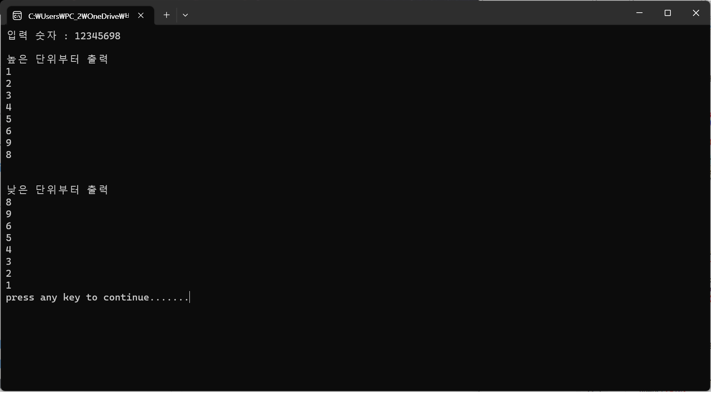
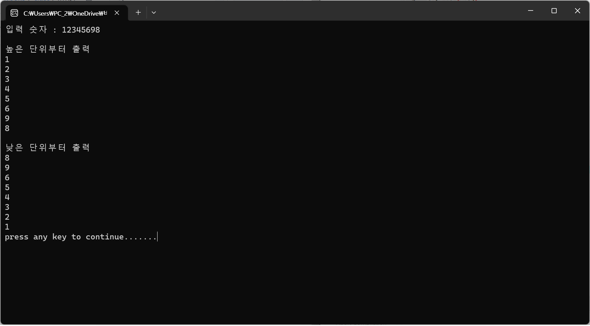
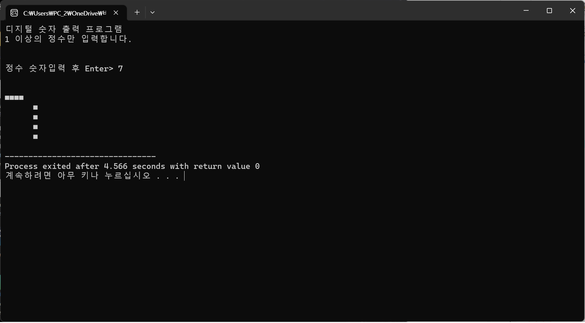
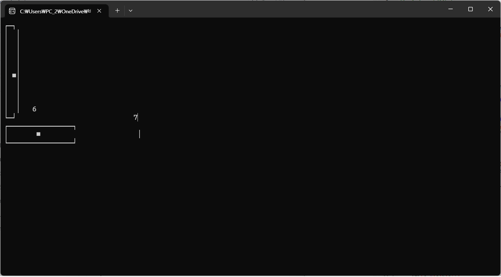
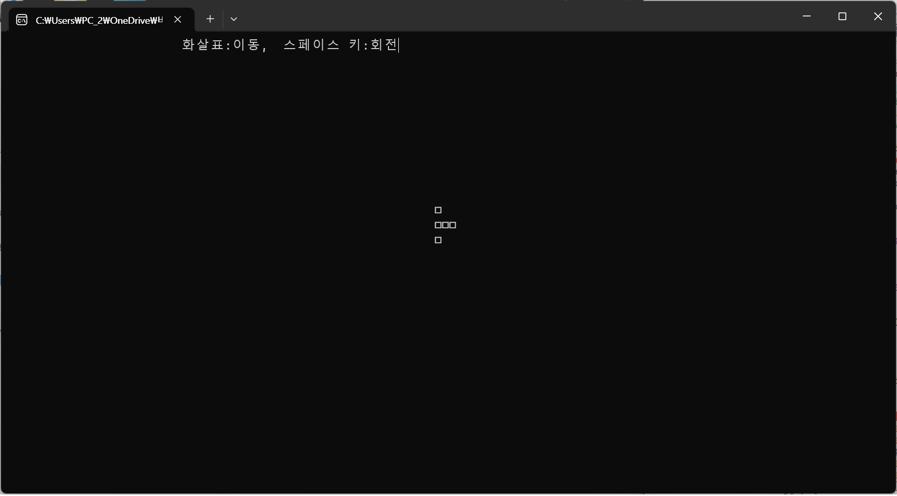

## 정방향.c 입력받은 수를 한자리씩 처리하기

## 역방향.c 입력받은 수를 뒤에서부터 한자리씩 처리하기

## 앞과뒤.c 12345698을 정방향, 역방향으로 한자리씩 처리하기

## 앞과뒤2.c 12345698을 정방향, 역방향으로 한자리씩 처리하기

## 디지털숫자.c 입력받은 수를 디지털숫자 모양으로 나타내기

## 수평수직슬라이드.c 숫자를 입력받고 그 크기의 수평,수직 슬라이드바를 화면에 출력한다

## 테트리스.c 화면의 테트리스 블록을 4방향(화살표)로 이동시킬 수 있으며 스페이스를 누르면 블록이 회전한다

